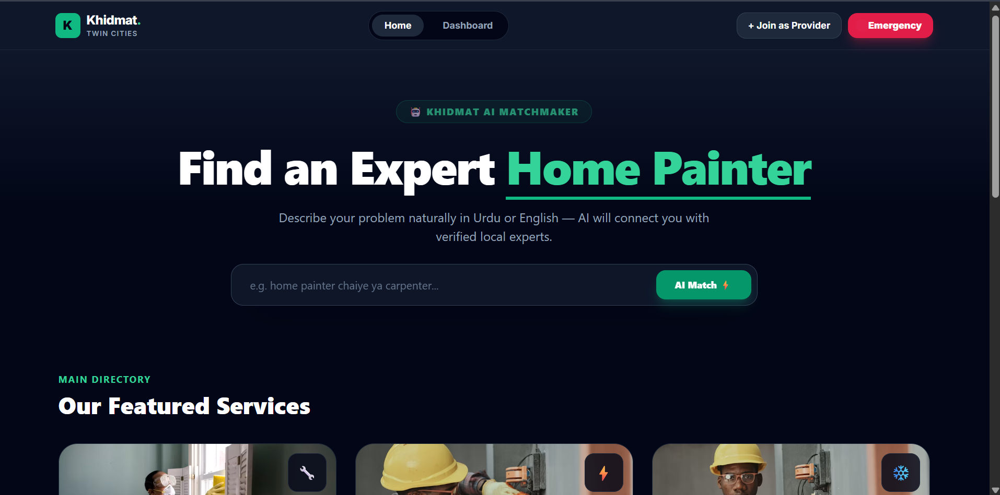
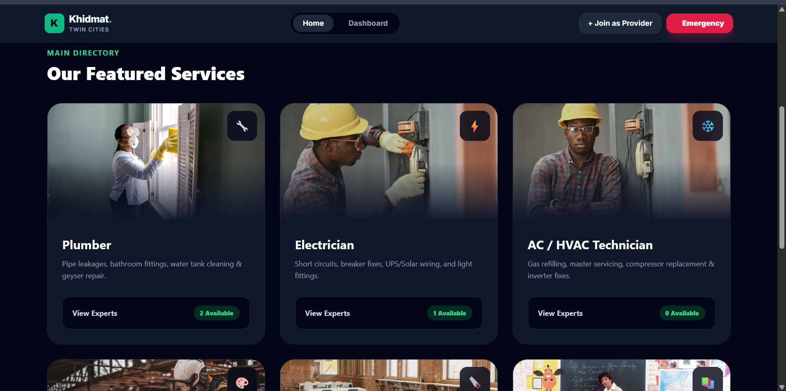
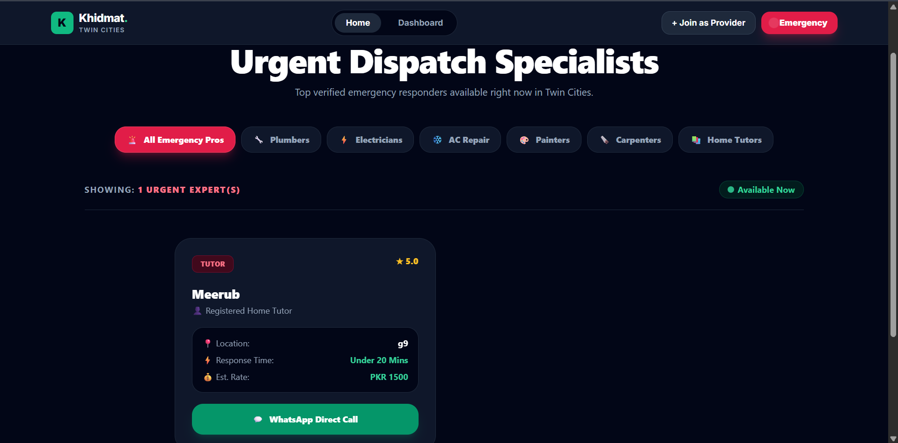
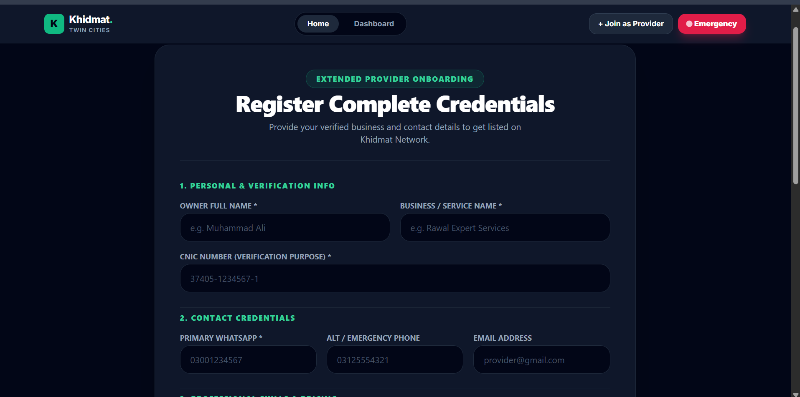
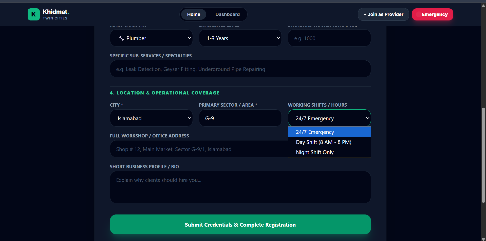
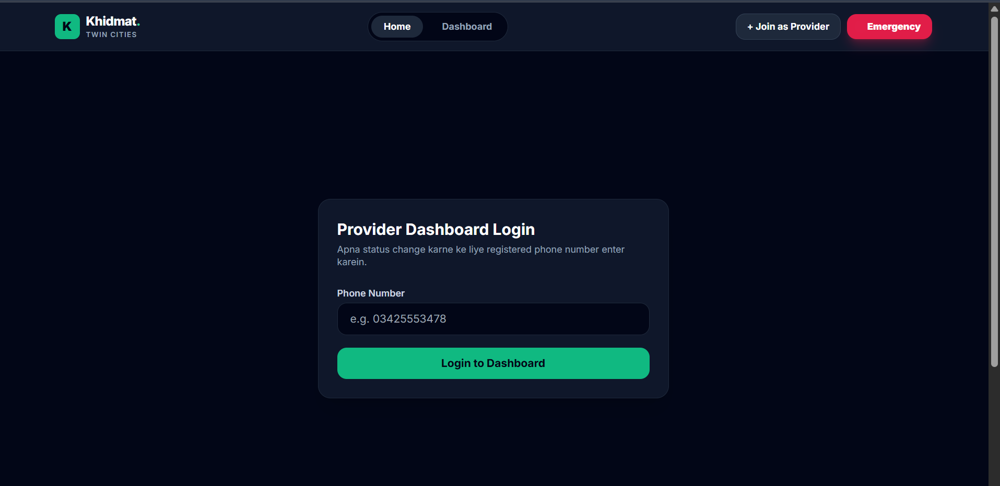

# Khidmat — Twin Cities Service Provider Marketplace 🇵🇰

**Khidmat** (خدمت — "service") is a local services marketplace that connects people in **Islamabad & Rawalpindi** with verified home-service providers — plumbers, electricians, AC technicians, painters, carpenters, home tutors, and more. It uses an AI/rule-based matching engine (with Roman Urdu & Urdu support) to recommend the right provider for a job, and lets users contact them instantly over WhatsApp — no signup required.

Built with **Next.js 14 (App Router)**, **React 18**, **Tailwind CSS**, and **Firebase (Firestore)**.

**🔗 Live Demo:** [khidmat-app-beige.vercel.app](https://khidmat-app-beige.vercel.app/)

---

## 📸 Screenshots

| Homepage — AI Matchmaker | Featured Services |
|---|---|
|  |  |

| Emergency Dispatch | Provider Registration |
|---|---|
|  |  |

| Provider Registration (contd.) | Provider Dashboard Login |
|---|---|
|  |  |

---

## ✨ Features

- **Category browsing** — Plumber, Electrician, AC/HVAC Technician, Painter, Carpenter, Appliance Repair, Home Cleaner, Home Tutor, and more.
- **AI-powered matching** (`/api/match`) — Understands natural-language requests in **English, Urdu, and Roman Urdu** (e.g. *"ghr paint krwana hai"*, *"nal kharab hai"*) and recommends the best-fit providers.
  - Uses **Groq** (`llama-3.1-8b-instant`) when a `GROQ_API_KEY` is configured.
  - Falls back to a transparent, explainable **keyword/dictionary matcher** when no API key is set — so the app works fully offline/free.
- **Rule-based recommender** (`lib/matcher.js`) — A weighted scoring engine (proximity, availability, rating, budget fit, verification, response time) with human-readable "why this provider" reasons — no paid AI dependency required.
- **Location-aware matching** — Uses the Haversine formula (`lib/haversine.js`) against a curated list of Islamabad/Rawalpindi sectors (`data/sectors.js`) for proximity scoring.
- **Emergency mode** (`/emergency`) — Quickly surface providers available right now for urgent jobs.
- **One-tap WhatsApp contact** — `lib/whatsapp.js` builds a pre-filled `wa.me` link with the job details, so users can message a provider instantly without an in-app chat system.
- **Provider registration** (`/provider/register`) — Providers can list their business, service category, rates, and coverage area.
- **Provider dashboard** (`/provider/dashboard`) — Providers verify by phone number and manage their listing/availability.
- **Reviews & ratings** (`lib/reviews.js`) — Customers can leave reviews; works with **Firestore** when configured, or falls back to **browser `localStorage`** so it works with zero setup.
- **Lightweight admin/moderation panel** (`/admin`) — Password-gated review moderation queue (MVP-only gate — not real auth, see [Security Notes](#-security-notes)).
- **Verified badges** — Visual trust indicator for vetted providers.
- **Fully responsive UI** — Mobile-first design with a responsive header/drawer navigation, built with Tailwind CSS.

---

## 🧰 Tech Stack

| Layer            | Technology                                  |
|-------------------|----------------------------------------------|
| Framework         | [Next.js 14](https://nextjs.org/) (App Router) |
| UI Library        | React 18                                     |
| Styling           | Tailwind CSS 3                               |
| Database          | Firebase Firestore (optional — has local fallback) |
| AI Matching       | Groq API (`llama-3.1-8b-instant`) with local fallback matcher |
| Messaging         | WhatsApp (`wa.me` deep links — no API key needed) |

---

## 📁 Project Structure

```
khidmat/
├── app/
│   ├── admin/                 # Review moderation panel (password-gated)
│   ├── api/
│   │   ├── match/             # AI/keyword-based provider matching endpoint
│   │   └── recommend/         # Recommendation endpoint
│   ├── category/[slug]/       # Category listing pages
│   ├── emergency/             # Emergency/urgent providers page
│   ├── match/                 # Matching flow page
│   ├── provider/
│   │   ├── [id]/               # Individual provider profile page
│   │   ├── dashboard/          # Provider self-service dashboard
│   │   └── register/           # Provider onboarding form
│   ├── layout.js
│   └── page.js                 # Homepage
├── components/                 # Reusable UI components (Header, Footer, Cards, etc.)
├── data/
│   ├── categories.js           # Service category definitions
│   ├── providers.js            # Seed provider data
│   └── sectors.js               # Islamabad/Rawalpindi sector coordinates
├── lib/
│   ├── firebase.js             # Firebase/Firestore initialization
│   ├── haversine.js            # Distance calculation utility
│   ├── matcher.js              # Rule-based scoring/recommender engine
│   ├── reviews.js               # Review read/write (Firestore + localStorage fallback)
│   └── whatsapp.js              # WhatsApp deep-link builder
├── tailwind.config.js
├── next.config.js
└── package.json
```

---

## 🚀 Getting Started

### Prerequisites

- [Node.js](https://nodejs.org/) 18+ and npm
- (Optional) A free [Firebase](https://firebase.google.com/) project for persistent, shared data
- (Optional) A free [Groq API key](https://console.groq.com/) for the AI matching engine

### Installation

```bash
# Clone the repository
git clone https://github.com/malyikariasat/khidmat-app.git
cd khidmat-app

# Install dependencies
npm install
```

### Environment Variables

Create a `.env.local` file in the project root. **All variables are optional for the MVP** — without them, the app runs fully on seed data (`data/providers.js`) and stores reviews in the browser's `localStorage`.

```bash
# Firebase (enables persistent, shared data via Firestore's free "Spark" plan)
NEXT_PUBLIC_FIREBASE_API_KEY=
NEXT_PUBLIC_FIREBASE_AUTH_DOMAIN=
NEXT_PUBLIC_FIREBASE_PROJECT_ID=
NEXT_PUBLIC_FIREBASE_STORAGE_BUCKET=
NEXT_PUBLIC_FIREBASE_MESSAGING_SENDER_ID=
NEXT_PUBLIC_FIREBASE_APP_ID=

# Groq API key (enables the AI-powered matcher; 

GROQ_API_KEY=

# MVP-only password gate for /admin — NOT real security.
# Replace with proper auth (e.g. Firebase Auth admin claims) before a public launch.
NEXT_PUBLIC_ADMIN_PASSWORD=
```

### Run the Development Server

```bash
npm run dev
```

Open [http://localhost:3000](http://localhost:3000) in your browser.

### Other Scripts

```bash
npm run build   # Production build
npm run start   # Start the production server
npm run lint    # Run ESLint
```

---

## 🤖 How Matching Works

1. A user submits a request (category, location/sector, urgency, budget, and free-text notes — which can be in English,  or Roman Urdu).
2. **`app/api/match/route.js`** first tries the **Groq AI matcher**: it sends the query and the candidate provider list to `llama-3.1-8b-instant` with strict rules (e.g. "never return tutors for home-maintenance requests") and expects back a JSON list of matching provider IDs.
3. Separately, **`lib/matcher.js`** provides a fully transparent, non-AI **weighted scoring engine** — factoring in proximity (Haversine distance), availability vs. urgency, rating, budget fit, verification status, and response time — each match includes human-readable reasons (e.g. *"Only ~1.2 km away"*, *"Verified provider"*).

---

